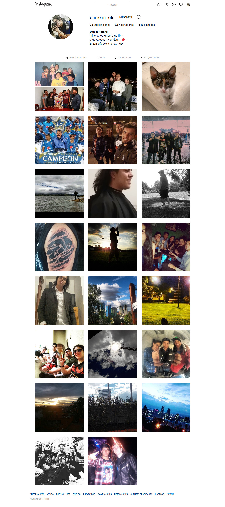
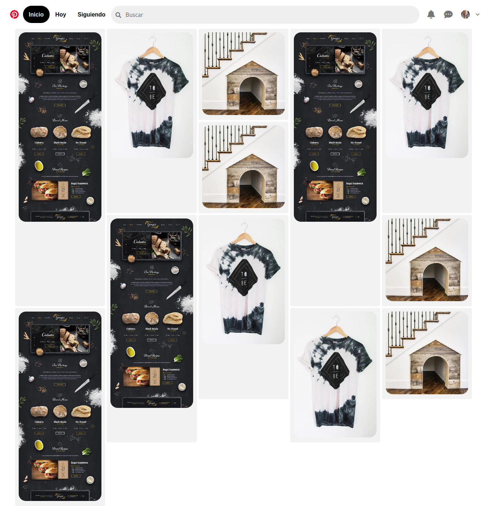

# CCS Grid

This repository contains three projects where I used CSS Grid to make them. Also there are some examples of how use some CSS Grid tools and functions. All this was developed from the Platzi's course CSS Grid Layout.

Each project is also responsive to different types of devices.

# Preview

Here are the previews of the projects done.

## Instagram

## Pinterest

---

You can see the projects following this [link]()
